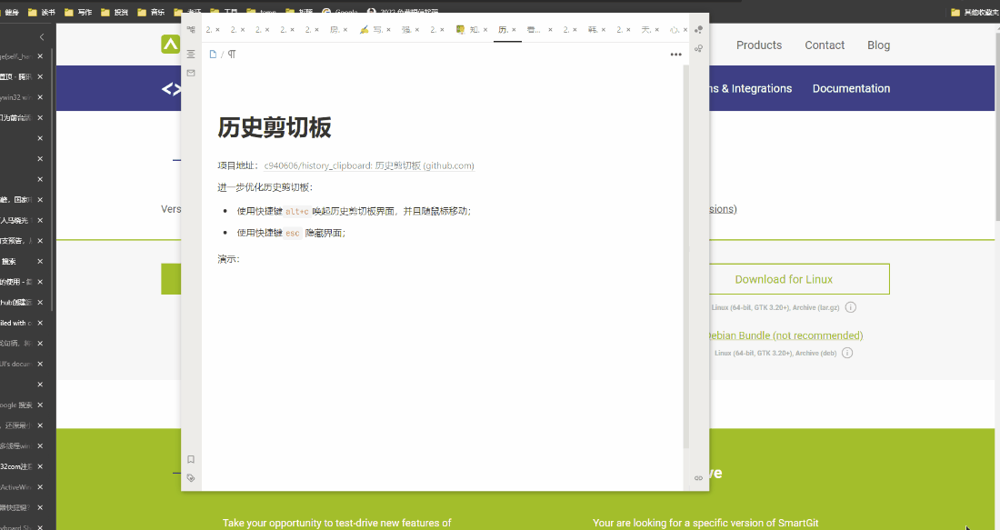

项目地址：[c940606/history_clipboard: 历史剪切板 (github.com)](https://github.com/c940606/history_clipboard)

## 进一步优化历史剪切板

* 使用快捷键`alt+c`唤起历史剪切板界面，并且随鼠标移动；
* 使用快捷键`esc` 隐藏界面；

## 演示

## 启动

`python ui.py`

`python main.py`

## 打包
https://pywebio.readthedocs.io/zh_CN/latest/libraries_support.html